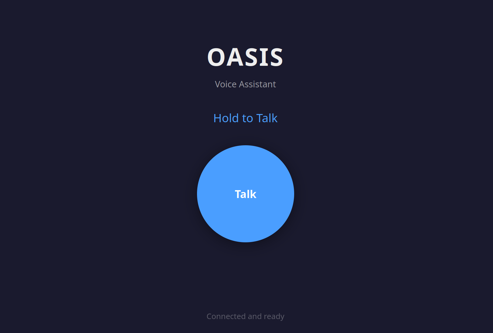

# Oasis



A proof-of-concept voice assistant that is fully local and fully private — no internet connection required after initial setup, designed to run on low-cost hardware.

## Requirements

- Node.js 22+
- Ollama running locally (or on a LAN host)
- Python 3.8+ with a virtual environment (only if using KittenTTS)

## Setup

### 1. Install Node dependencies

```bash
npm install
```

### 2. Configure environment

Copy the example and edit:

```bash
cp .env.example .env
```

Required:

| Variable | Description |
|---|---|
| `OLLAMA_BASE_URL` | Ollama API endpoint, e.g. `http://localhost:11434/api` |

Optional:

| Variable | Default | Description |
|---|---|---|
| `PORT` | `3001` | Express server port |
| `TTS_MODEL` | `onnx-community/Kokoro-82M-ONNX` | TTS model (see below) |
| `TTS_VOICE` | `af_heart` | Voice name (Kokoro/KittenTTS only) |

### 3. TTS model options

**Kokoro** (default, JS-native, no extra setup):
```
TTS_MODEL=onnx-community/Kokoro-82M-ONNX
TTS_VOICE=af_heart   # af_bella, am_eric, bm_george, bf_emma, ...
```

**KittenTTS** (Python bridge, higher quality, requires venv):
```
TTS_MODEL=KittenML/kitten-tts-nano-0.8-fp32
TTS_VOICE=Luna   # Bella, Jasper, Luna, Bruno, Rosie, Hugo, Kiki, Leo
```

Set up the Python venv once:
```bash
python3 -m venv .venv
.venv/bin/pip install https://github.com/KittenML/KittenTTS/releases/download/0.8.1/kittentts-0.8.1-py3-none-any.whl
```

The server auto-detects `.venv/bin/python3` and uses it for the bridge process.

**speecht5 / mms** (JS-native, no extra setup):
```
TTS_MODEL=Xenova/speecht5_tts
# or
TTS_MODEL=Xenova/mms-tts-eng
```

### 4. Run

```bash
npm run dev
```

Open `http://localhost:5173`. Press and hold the button to speak, release to get a response.

ML models are downloaded from Hugging Face on first run and cached locally.

## Roadmap

### Full-duplex conversation
Move from press-to-talk to a natural, always-listening mode:
- **Voice activity detection (VAD)** — detect speech start/end automatically, no button required (Silero VAD has a WASM build usable in-browser)
- **Interruption support** — let the user cut off the assistant mid-response; drain the audio queue and cancel the in-flight pipeline
- **Streaming STT** — Whisper is batch-only; evaluate streaming-capable alternatives (Moonshine, Vosk) or a sliding-window chunked approach

### IoT device client
Run Oasis on low-cost hardware (Raspberry Pi, Orange Pi, similar):
- Native audio I/O client using ALSA/PulseAudio — no browser required
- Evaluate running STT and TTS models directly on-device (Whisper tiny, Kokoro, KittenTTS nano) to remove the server dependency entirely
- Explore quantized LLMs small enough for edge hardware (Gemma 3 270M, Qwen 2.5 0.5B)
- Physical button or wake-word trigger as an alternative to VAD

### Useful integrations & memory
Make the assistant actually useful beyond Q&A:
- **Persistent memory** — store and retrieve facts about the user across sessions (manually curated or extracted automatically from conversation)
- **Tool use / integrations** — home automation (Home Assistant), calendar, timers, web search for grounding
- **Existing assistant frameworks** — evaluate integrating with or replacing the LLM layer with a purpose-built local assistant (e.g. Picoclaw, Open Voice OS) for richer skill support

## References

**STT**
- [Xenova/whisper-tiny.en](https://huggingface.co/Xenova/whisper-tiny.en) — quantized Whisper model used for transcription
- [transformers.js-examples/whisper-node](https://github.com/huggingface/transformers.js-examples/blob/main/whisper-node/utils.js) — reference Node.js Whisper implementation
- [Transformers.js pipeline API](https://huggingface.co/docs/transformers.js/api/pipelines) — pipeline docs (TextToAudio, AutomaticSpeechRecognition)

**TTS**
- [KittenTTS](https://github.com/KittenML/KittenTTS) — lightweight TTS (15–80M params), used via Python bridge
- [KittenTTS available models](https://github.com/KittenML/KittenTTS#available-models)
- [KittenTTS ONNX model internals](https://github.com/KittenML/KittenTTS/blob/main/kittentts/onnx_model.py)
- [mlx-community/kitten-tts-nano-0.8](https://huggingface.co/mlx-community/kitten-tts-nano-0.8) — MLX port (Apple Silicon)
- [kokoro-js](https://www.npmjs.com/package/kokoro-js) — JS-native Kokoro TTS used as default backend
- [Moxin-TTS](https://huggingface.co/cshbli/Moxin-TTS) — Kokoro-based model variant worth exploring
- [wavefile](https://www.npmjs.com/package/wavefile) — WAV encoding/decoding

**LLM**
- [gemma-3-270m](https://huggingface.co/google/gemma-3-270m) — candidate for on-device / low-memory inference
- [gemma-3n-E2B](https://huggingface.co/google/gemma-3n-E2B) — multimodal variant, possible future direction

**Audio / Node.js**
- [speaker](https://www.npmjs.com/package/speaker) — PCM audio output for Node.js (used in experiments)
- [node-audiorecorder](https://www.npmjs.com/package/node-audiorecorder) — microphone input for Node.js (IoT client candidate)

## Experiments

Standalone scripts for testing individual components:

```bash
npx tsx experiments/kokoro.ts      # Kokoro TTS
npx tsx experiments/kittentts.ts   # KittenTTS via transformers.js (v0.1 — limited)
python3 experiments/kittentts.py   # KittenTTS via Python (v0.8 — requires venv)
npx tsx experiments/stt.ts         # Whisper STT
npx tsx experiments/llm.ts         # Ollama LLM
npx tsx experiments/tts.ts         # speecht5 / mms TTS
```
